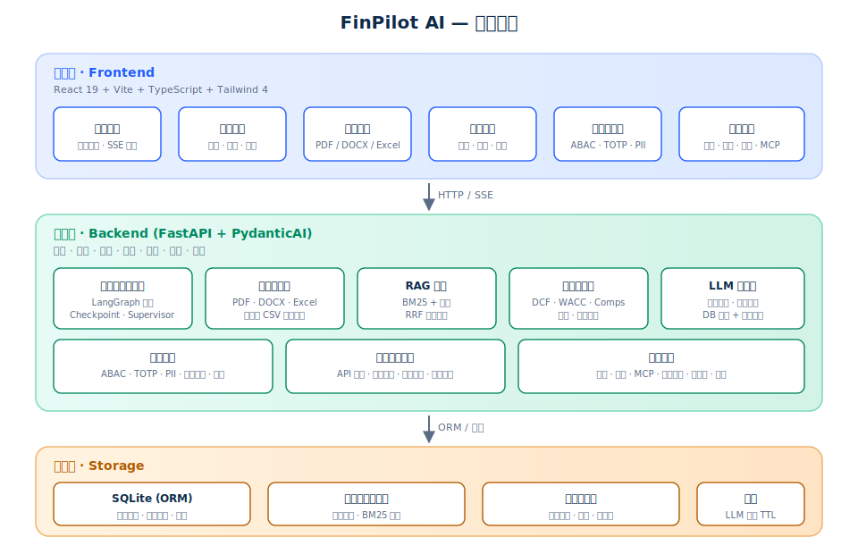
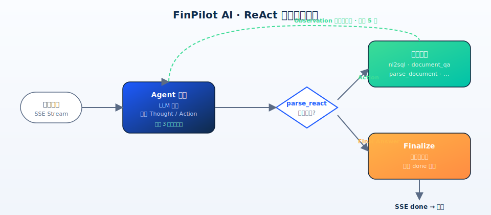

<div align="center">
  
</div>

<div align="center">

# FinPilot AI

[English](README.md) | [中文](README.zh.md) | [日本語](README.ja.md)

**企業財務向けエージェントプラットフォーム · 自律推論 · 全工程の観測性**

[](LICENSE)
[](https://www.python.org/)
[](https://fastapi.tiangolo.com/)
[](https://react.dev/)
[](https://www.typescriptlang.org/)
[](https://vitejs.dev/)
[](https://tailwindcss.com/)
[](https://github.com/langchain-ai/langgraph)
[](CHANGELOG.md)
[](CONTRIBUTING.md)
[](#コントリビューション)

**エージェント · 財務モデリング · レポートセンター · セキュリティとコンプライアンス · 精細なエラー処理 · 対話による操作**

[クイックスタート](#クイックスタート) ·
[主な機能](#主な機能) ·
[アーキテクチャ](#アーキテクチャ) ·
[ReAct ワークフロー](#react-ワークフロー) ·
[対話による操作ハブ](#対話による操作ハブ) ·
[エラーシステム](#エラーシステム) ·
[技術スタック](#技術スタック) ·
[プロジェクト構成](#プロジェクト構成) ·
[環境変数](#環境変数) ·
[ロードマップ](#ロードマップ) ·
[コントリビューション](#コントリビューション)

</div>

---

## 設計思想

FinPilot AI は企業財務チームの実際のワークフローを「**認知 → 推論 → 実行 → 記録**」の四段階ループとして抽象化します。

- **LangGraph** がオーケストレーションする複数役割のエージェントが、分析・モデリング・議論・統合を担います。
- 財務計算は**決定論的なコードパス**（DCF、WACC、類似会社比較、バックテスト）で実行し、LLM は叙述と説明のみを担当します。
- API 呼び出し、Q&A、モジュールのトグルごとに**実行ログ**へ書き込まれ、プロセス全体が追跡・監査可能です。

> 数値はコードで計算し、叙述はモデルが生成し、出力のすべての行が出処を追跡できます。

---

## 主な機能

| モジュール | 主な機能 |
| :--- | :--- |
| 🤖 **Q&A エージェント** | 対話形式で Excel / PDF / CSV / DOCX をアップロード、自動解析とコンテキスト注入、**SSE ストリーミング**で ReAct 推論ステップをリアルタイムにプッシュ |
| 📊 **財務モデリング** | DCF、DDM、LBO、WACC、類似会社比較、モンテカルロを純 Python の計算オペレータとして実装 |
| 📑 **レポートセンター** | レポートテンプレート、サブスクリプション配信、承認ワークフローによる構造化された研究成果の出力 |
| 🔍 **ドキュメント解析** | マルチフォーマットパーサー（PDF / DOCX / Excel / CSV）+ RAG 検索（BM25 + ベクトル + RRF フュージョン） |
| 🛡 **セキュリティ・コンプライアンス** | ABAC アクセス制御、TOTP 二要素認証、PII マスキング、インジェクション防御、監査ログ、**ロール階層の権限** |
| 📡 **実行ログ** | ログ一覧 / Q&A インタラクション / モジュール状態 / 統計ダッシュボードの 4 タブでリアルタイム監視 |
| 🧰 **拡張体系** | ツール、スキル、MCP サーバー、コードサンドボックス、プロンプト管理を統合接入 |
| 💬 **対話による操作** | **スラッシュコマンドシステム**——チャット画面から全機能を呼び出し、ロールで権限をフィルタ |
| 🚨 **精細なエラー処理** | **FetchError + レベル別ハイライト**——ネットワーク / 認証 / リクエスト / サーバーの 4 色アラート |

---

## アーキテクチャ

<div align="center">
  
</div>

全体は三層構造です。

- **プレゼンテーション層** — React 19 + Vite SPA。チャット / レポート / 監査 / 管理のマルチパネルとリアルタイム SSE プッシュを提供。
  - `AgentChatPage` はスラッシュコマンドパレット、レベル別エラーバー、ストリーミング推論ステップを統合。
  - `MarkdownRenderer` は XSS サニタイズとコードブロックのシンタックスハイライトを同梱。
  - `SlashCommandPalette` は曖昧検索、キーボードナビゲーション、ロールフィルタを提供。
- **サービス層** — FastAPI + LangGraph。ルーティング / 認証 / エージェントオーケストレーション / 解析 / 検索 / 計算 / 記録を担う。
  - ReAct エージェントは `agent.stream(stream_mode="updates")` で各ノードの状態をリアルタイムにプッシュ。
  - 複数の LLM 出力フォーマットに対応：標準 ReAct 三段形式、`<tool_call>` XML、`<answer>` タグ。
  - LLM 設定はデータベースから優先読み込み（管理画面で保守）、環境変数はフォールバック。
- **データ層** — SQLite（ORM）、ベクトルストア、BM25 転置インデックス、ファイル・設定ストレージ。
  - ReAct チェックポイントは `memory`（デフォルト）と `sqlite`（永続化）の 2 バックエンドをサポート。

---

## ReAct ワークフロー

<div align="center">
  
</div>

ReAct ループは最大 5 ラウンドのツール呼び出しを実行し、各ノードの完了を SSE でリアルタイムにプッシュします。

- **start** — セッション作成
- **thinking_token** — エージェントの推論 / ツール呼び出し / Observation 結果
- **answer_token** — 最終回答の差分
- **done** — 推論チェーン、信頼度、intent を伴う終端イベント
- **error** — 詳細エラー情報を伴う例外イベント

**ハートビート保護**：15 秒以内にイベントがない場合は `…` をプッシュし、フロントエンドがタイムアウトと誤判断するのを防ぎます。

---

## 対話による操作ハブ

チャット画面は FinPilot の制御ハブです。管理者は対話ボックスからスラッシュコマンドで全機能を呼び出し、プログラム・アプリケーション・エージェント全体を制御できます。一般ユーザーは許可された範囲内のコマンドのみ呼び出せます。

### スラッシュコマンドパレット

入力ボックスで `/` を入力するとコマンドパレットが開き、曖昧検索、キーボードの上下選択、カテゴリ別グループ化をサポートします。全コマンドはロールでフィルタされます。

| カテゴリ | コマンド例 | ロール |
| :--- | :--- | :--- |
| **help** | `/help`、`/?` | 全ユーザー |
| **data** | `/dashboard`、`/queries history`、`/conversations list`、`/documents list` | user |
| **report** | `/reports list`、`/reports generate 600519 貴州茅台`、`/reports status <task_id>` | user |
| **analysis** | `/factor categories`、`/backtest strategies` | user |
| **system** | `/admin status`、`/admin health`、`/models list`、`/models test <provider_id>` | admin |
| **admin** | `/users list`、`/audit logs`、`/approvals list`、`/templates list`、`/subscriptions list` | admin |

### 権限階層

- **管理者（admin）**：全 19 コマンドを呼び出し可能。データ / レポート / 分析 / システム / 管理の 5 カテゴリをカバー。
- **一般ユーザー（user）**：help + data + report + analysis の 4 カテゴリ、計 9 コマンドのみ呼び出し可能。システム状態、ユーザー管理、監査ログなどの機密操作にはアクセス不可。
- バックエンドの `require_admin` 依存が全 admin コマンドのエンドポイントを再検証し、フロントエンドのフィルタは UX 最適化のみ。

---

## エラーシステム

FinPilot のエラーシステムは**精確な特定と高い視認性**を目指し、「操作に失敗しました。後でもう一度お試しください」のような情報量のないフォールバックを排除します。

### エラーレベルと配色

各エラーはレベルに応じて異なる色の「アラートライト」を表示し、パルスアニメーション、グロー、グラデーション背景を伴い、ダーク / ライト両テーマで視認性を確保します。

| レベル | 色 | トリガー |
| :--- | :--- | :--- |
| `network` | グレー | 接続タイムアウト、DNS 失敗、CORS 拒否、バックエンド未起動 |
| `auth` | イエロー | 401 未ログイン、403 権限不足 |
| `client` | オレンジ | 400 / 404 / 422 リクエストパラメータエラー、ルート不在 |
| `server` | レッド | 500 / 502 / 503 サーバー内部エラー |
| `unknown` | レッド | 未分類のフォールバック |

### エラーメッセージ形式

エラーバーは失敗したエンドポイント、HTTP メソッド、ステータスコード、バックエンド返却の detail を表示します。例：

```
[POST /agent/chat/stream] 500 サーバー内部エラー — KeyError: 'react_steps'
[network] リクエストタイムアウト（30s）— バックエンドが規定時間内に応答せず、LLM 推論の遅延またはバックエンド阻塞の可能性
[GET /model-configs] 422 バリデーション失敗 — body.question: field required
```

### 実装のポイント

- `FetchError` クラス：`status` / `url` / `method` / `bodyText` / `code` を保持し、`fetch`（axios ではない）で呼び出す SSE エンドポイントも統一エラーシステムを再利用可能。
- `getErrorLevel(err)`：FetchError / AxiosError / DOMException / TypeError からエラーレベルを自動推論。
- `getErrorMessage(err)`：生のエラーを、出所タグ、ステータスコード、バックエンド原因を伴う精確な文字列に変換。

---

## 技術スタック

| カテゴリ | 選定 |
| :--- | :--- |
| バックエンド | Python 3.10–3.13、FastAPI、LangGraph、SQLAlchemy、Pydantic |
| フロントエンド | React 19、Vite、TypeScript、Tailwind 4、Zustand、Recharts、i18next |
| ドキュメントと検索 | pdfplumber、python-docx、openpyxl、pandas、BM25、ベクトル検索、RRF フュージョン |
| データ | SQLite（デフォルト）、PostgreSQL（本番可选） |
| デプロイ | Docker、Uvicorn、Nginx（オプションのリバースプロキシ） |
| セキュリティ | ABAC、TOTP、PII マスキング、インジェクション防御、監査ログ |

---

## クイックスタート

### 1. リポジトリのクローン

```bash
git clone https://github.com/weed33834/FinPilot.git
cd FinPilot
```

> GitCode ミラー：`git clone https://gitcode.com/badhope/FinPilot.git`

### 2. Python 環境の準備

```bash
python3 -m venv venv
source venv/bin/activate   # Windows: venv\Scripts\activate
pip install -e .
```

> Python 3.10–3.13 が必要です。[pyenv](https://github.com/pyenv/pyenv) による複数バージョン管理を推奨します。

### 3. 環境変数の設定

サンプルファイルをコピーし、必要に応じて変更します（すべての変数はオプション）。

```bash
cp .env.example .env
```

最小構成は LLM プロバイダの設定のみです。FinPilot の LLM 設定は**データベースから優先読み込み**（管理画面 → LLM プロバイダページで保守）、環境変数はフォールバックとなります。

**方式 A：環境変数を使用（簡易試用）**

```bash
export OPENAI_API_KEY="sk-..."
# オプション：
export OPENAI_BASE_URL="https://api.openai.com/v1"
export OPENAI_MODEL="gpt-4o-mini"
```

**方式 B：MoonWeaver を使用（OpenAI 互換プロトコル）**

```bash
# 管理画面 → LLM プロバイダページで作成：
#   name=MoonWeaver, provider_type=openai, base_url=https://api.587.lol/v1
#   api_key=any, is_default=true
#   models: moonweaver-4.8（API は現在このモデルのみ提供、high/low tier 両方に割当可能）
```

Anthropic もサポートしています：

```bash
export ANTHROPIC_API_KEY="sk-ant-..."
export ANTHROPIC_MODEL="claude-3-5-sonnet-20241022"
```

### 4. バックエンドの起動

```bash
uvicorn finpilot_equity.web_app.main:app --host 0.0.0.0 --port 8001
```

初回起動時にデータベースが自動作成され、デフォルト管理者アカウントが初期化されます。

| 項目 | 値 |
| :--- | :--- |
| ユーザー名 | `admin@finpilot.ai` |
| パスワード | `admin123` |

> ⚠️ 初回ログイン後、直ちに「ユーザー管理」でデフォルトパスワードを変更してください。

### 5. フロントエンドの起動

```bash
cd frontend
npm install
npm run dev
```

ブラウザで `http://localhost:5173` を開き、デフォルト管理者アカウントでログインします。

### 6. コンテナデプロイ（オプション）

```bash
docker build -t finpilot-ai:1.0.0 .
docker run -d \
  -p 8001:8001 \
  --env-file .env \
  --name finpilot finpilot-ai:1.0.0
```

詳細なデプロイ手順は [docs/DEPLOYMENT.md](docs/DEPLOYMENT.md) を参照してください。

---

## プロジェクト構成

```
FinPilot AI
├── finpilot/                 # バックエンドビジネスパッケージ
│   ├── agent/                # マルチエージェントランタイム（LangGraph オーケストレーション）
│   │   ├── graph.py          # ReAct グラフ構築 + run_agent エントリ
│   │   ├── react_nodes.py    # agent/tools/finalize ノード + マルチフォーマットパーサー
│   │   ├── checkpoint.py     # チェックポイントバックエンド（memory / sqlite）
│   │   └── tools/            # 内蔵ツール（nl2sql / document_qa / parse_document）
│   ├── api/                  # FastAPI ルート
│   │   ├── router.py         # 集約ルート + デフォルト管理者初期化
│   │   ├── agent.py          # SSE ストリーミングチャット（agent.stream）
│   │   ├── compat.py         # フロントエンド契約互換レイヤ
│   │   ├── llm_providers.py  # LLM プロバイダ CRUD
│   │   └── deps.py           # 認証依存（require_admin / get_current_user）
│   ├── database/             # ORM モデルと CRUD
│   ├── llm/                  # LLM クライアント / 設定 / モデルルーティング
│   ├── parser/               # マルチフォーマットドキュメントパーサー（PDF / DOCX / Excel / CSV）
│   ├── rag/                  # 検索拡張（BM25 + ベクトル + RRF フュージョン）
│   ├── security/             # ABAC / TOTP / PII / 監査 / インジェクション防御
│   ├── services/             # ビジネスサービス（バリュエーション / バックテスト / サンドボックス / 実行ログ / ...）
│   ├── text2sql/             # 自然言語から SQL への変換
│   └── utils/                # 共通ユーティリティ
├── finpilot_equity/          # Web アプリケーションエントリパッケージ
│   └── web_app/              # FastAPI アプリケーション組み立て（ルートマウント / CORS / DB 初期化）
├── frontend/                 # React + Vite SPA
│   └── src/
│       ├── pages/            # AgentChatPage / Admin / Reports / ...
│       ├── components/       # SlashCommandPalette / MarkdownRenderer / ReasoningChain / ...
│       ├── utils/            # errors.ts (FetchError) / slashCommands.ts / ...
│       ├── api/              # client.ts / adminClient.ts (axios インスタンス)
│       ├── stores/           # authStore (zustand, role フィールド)
│       └── index.css         # グローバルスタイル + エラーバーハイライト
├── docs/                     # プロジェクトロゴ、アーキテクチャ図、ワークフロー図、API/アーキテクチャ/デプロイドキュメント
├── .github/                  # Issue / PR テンプレート + CI workflow
├── .env.example              # 環境変数サンプル
├── CHANGELOG.md              # 変更履歴
├── CONTRIBUTING.md           # コントリビューションガイド
├── SECURITY.md               # セキュリティポリシー
├── CODE_OF_CONDUCT.md        # 行動規範
├── Dockerfile                # コンテナビルド定義
├── setup.py                  # Python パッケージ定義
├── requirements.txt          # Python 依存関係
├── requirements-equity.txt   # Web アプリ最小依存関係
└── README.md
```

---

## 環境変数

完全な環境変数リストは [`.env.example`](.env.example) を参照してください。概要：

| 変数 | 用途 | デフォルト値 |
| :--- | :--- | :--- |
| `FINPILOT_ADMIN_EMAIL` | デフォルト管理者メール | `admin@finpilot.ai` |
| `FINPILOT_ADMIN_PASSWORD` | デフォルト管理者パスワード | `admin123` |
| `FINPILOT_ADMIN_EMAILS` | 管理者メール許可リスト（カンマ区切り） | `admin@finpilot.ai` |
| `OPENAI_API_KEY` / `OPENAI_BASE_URL` / `OPENAI_MODEL` | OpenAI プロバイダ | — |
| `ANTHROPIC_API_KEY` / `ANTHROPIC_BASE_URL` / `ANTHROPIC_MODEL` | Anthropic プロバイダ | — |
| `FINPILOT_LLM_DEMO_FALLBACK` | LLM 利用不可時にデモフォールバックを有効にするか | 無効 |
| `FINPILOT_CHECKPOINT_BACKEND` | ReAct チェックポイントバックエンド（`memory` / `sqlite`） | `memory` |
| `GITHUB_CLIENT_ID` / `GITHUB_CLIENT_SECRET` / `GITHUB_REDIRECT_URI` | GitHub OAuth ログイン | プレースホルダ |

---

## 実行ログモジュール

設定セクションに組み込みの「実行ログ」モジュールがあり、全プロセスの実行状態をリアルタイムに監視します。

| タブ | 用途 |
| :--- | :--- |
| **統計ダッシュボード** | 総ログ数、本日新增、成功率、モジュール有効状態の集計 |
| **ログ一覧** | 各 API 呼び出しのカテゴリ / レベル / 出所 / 所要時間 / ステータスコード / Payload 詳細 |
| **Q&A インタラクション** | セッション単位の集計、ユーザー質問とエージェント回答を再生 |
| **モジュール状態** | LLM / ツール / スキル / サンドボックス / MCP / RAG / Text2SQL などのモジュール有効統計 |

ログ書き込みはベストエフォート方式で、書き込み失敗が主フローに影響しません。CSV に一括エクスポートしてオフライン分析も可能です。

---

## ロードマップ

- ✅ **v1.0.0** — Q&A エージェント、ドキュメント解析、実行ログ、レポートと承認、セキュリティ/コンプライアンス基盤、スラッシュコマンドシステム、レベル別エラーシステム、SSE ストリーミング ReAct プッシュ
- 🚧 **v1.1.0** — マルチエージェント議論オーケストレーション、レポートサブスクリプションスケジューリング、エンタープライズ SSO
- 📌 **v1.2.0** — リアルタイム行情接入、定量バックテスト強化、ナレッジグラフ統合

完全な変更履歴は [CHANGELOG.md](CHANGELOG.md) を参照してください。

---

## コントリビューション

Issue と Pull Request を歓迎します。開発規約とコミット規範は [CONTRIBUTING.md](CONTRIBUTING.md) を先にお読みください。行動規範は [CODE_OF_CONDUCT.md](CODE_OF_CONDUCT.md) を参照してください。

セキュリティ脆弱性の報告は [SECURITY.md](SECURITY.md) に従ってください。**セキュリティ脆弱性を公開 Issue で開示しないでください。**

### コントリビューター

<a href="https://github.com/weed33834/FinPilot/graphs/contributors">
  
</a>

> GitCode ミラー：<https://gitcode.com/badhope/FinPilot>

---

## ライセンス

本プロジェクトは [MIT License](LICENSE) の下でオープンソース化されています。著作権は FinPilot AI プロジェクトチームに帰属し、他の外部プロジェクトとは一切の関係を持ちません。

---

> **免責事項**：本プロジェクトのコードとドキュメントは学習・研究目的のみで提供され、金融助言や取引推奨と解釈されるべきではありません。実際の取引や投資の前に、資格のある専門家に相談してください。
