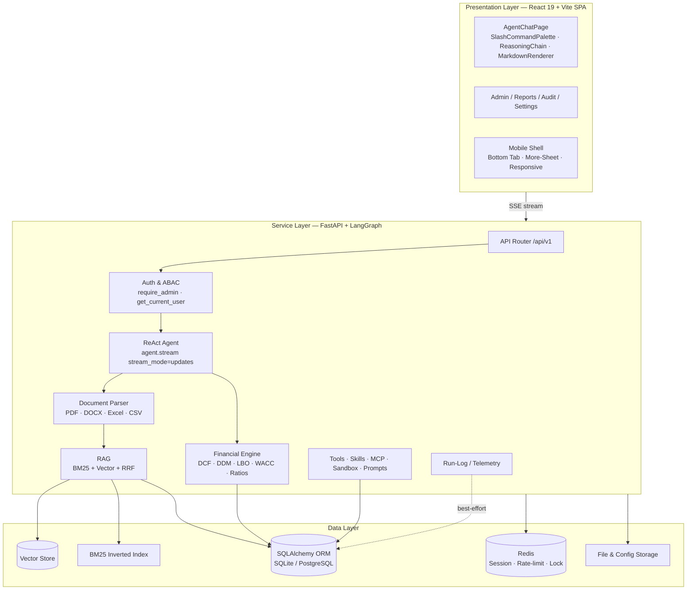
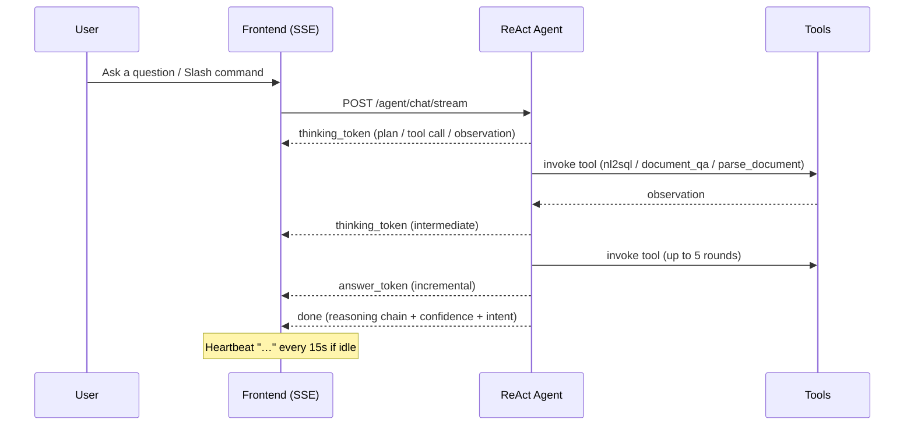

<div align="center">
  
</div>

<div align="center">

# FinPilot AI

**エンタープライズ金融向けオープンソースAIエージェントプラットフォーム · 自律的推論 · フルスタックの可観測性**

[](#finpilot-ai)
[](LICENSE)
[](https://www.python.org/)
[](https://fastapi.tiangolo.com/)
[](https://react.dev/)
[](https://www.typescriptlang.org/)
[](https://vitejs.dev/)
[](https://tailwindcss.com/)
[](https://github.com/langchain-ai/langgraph)
[](CHANGELOG.md)
[](CONTRIBUTING.md)

**🤖 エージェント · 📊 財務モデリング · 📑 レポートセンター · 🛡 セキュリティとコンプライアンス · 🚨 的確なエラー表示 · 💬 Chat-as-Control**

クイックスタート · 主な機能 · アーキテクチャ · ReActワークフロー · Chat-as-Control · エラーシステム · 技術スタック · プロジェクト構成 · 環境変数 · ロードマップ · コントリビュート

</div>

---

<p align="center">
  <a href="README.md">English</a> ·
  <a href="README.zh-CN.md">中文</a> ·
  <a href="README.ja.md"><strong>日本語</strong></a>
</p>

---

## 設計思想

FinPilot AI は、実際のエンタープライズ金融チームの業務フローを **Perceive → Reason → Act → Trace**（認識 → 推論 → 行動 → 追跡）という4段階の閉ループに抽象化します。

- **LangGraph** がオーケストレーションするマルチロールのエージェントが、分析・モデリング・議論・統合を担います。
- 財務計算は **決定論的なコードパス**（DCF、WACC、比較企業分析、バックテスト）上で実行され、LLM はナラティブ（物語・説明）の生成のみを担います。
- すべてのAPI呼び出し、すべてのQ&Aターン、すべてのモジュール切替は **ランログ** に記録され、システム全体が追跡可能かつ監査可能となります。

> **数値はコードで計算し、ナラティブはモデルが生成し、すべての出力行は出所をたどれる。**

---

## 主な機能

| モジュール | 主な機能 |
| :--- | :--- |
| 🤖 **会話型Q&A** | Excel / PDF / CSV / DOCX をチャットでアップロード、自動的にコンテキストへ解析、**SSEストリーミング** でReActの推論ステップをリアルタイムに配信 |
| 📊 **財務モデリング** | DCF、DDM、LBO、WACC、比較企業分析、モンテカルロ — 純粋なPython計算オペレーター |
| 📑 **レポートセンター** | レポートテンプレート、購読プッシュ、承認ワークフロー、構造化された調査出力 |
| 🔍 **文書解析** | マルチフォーマット対応パーサー（PDF / DOCX / Excel / CSV）＋ RAG検索（BM25 ＋ ベクトル ＋ RRF融合） |
| 🛡 **セキュリティとコンプライアンス** | ABACアクセス制御、TOTP 2FA、PIIマスキング、インジェクション保護、監査ログ、**ロールベースの権限** |
| 📡 **ランログ** | 4タブのライブ監視：ログ一覧 / Q&A対話 / モジュール状態 / 統計ダッシュボード |
| 🧰 **拡張性** | ツール、スキル、MCPサーバー、コードサンドボックス、プロンプト管理への統一的なアクセス |
| 💬 **Chat-as-Control** | **スラッシュコマンドシステム** — チャットUIからすべての機能を呼び出し、ロールでフィルタリング |
| 📱 **モバイルファースト** | 独立したレスポンシブなモバイルシェル（ボトムタブ ＋ その他シート）、デスクトップ専用ページは適切に縮退 |
| 🚨 **的確なエラー表示** | **FetchError ＋ レベル別ハイライト** — ネットワーク / 認証 / リクエスト / サーバーの4色アラートランプ |

---

## アーキテクチャ

<div align="center">
  
</div>

システムは3層に分かれています。


```mermaid
flowchart TB
  subgraph Client["Presentation Layer — React 19 + Vite SPA"]
    Chat[AgentChatPage<br/>SlashCommandPalette · ReasoningChain · MarkdownRenderer]
    Admin[Admin / Reports / Audit / Settings]
    Mobile[Mobile Shell<br/>Bottom Tab · More-Sheet · Responsive]
  end
  subgraph API["Service Layer — FastAPI + LangGraph"]
    Router[API Router /api/v1]
    Auth[Auth & ABAC<br/>require_admin · get_current_user]
    Agent[ReAct Agent<br/>agent.stream stream_mode=updates]
    Parser[Document Parser<br/>PDF · DOCX · Excel · CSV]
    RAG[RAG<br/>BM25 + Vector + RRF]
    Calc[Financial Engine<br/>DCF · DDM · LBO · WACC · Ratios]
    Ext[Tools · Skills · MCP · Sandbox · Prompts]
    Telemetry[Run-Log / Telemetry]
  end
  subgraph Data["Data Layer"]
    DB[(SQLAlchemy ORM<br/>SQLite / PostgreSQL)]
    Vec[(Vector Store)]
    BM25[BM25 Inverted Index]
    Redis[(Redis<br/>Session · Rate-limit · Lock)]
    FS[File & Config Storage]
  end
  Client -->|SSE stream| API
  Router --> Auth --> Agent
  Agent --> Parser --> RAG
  Agent --> Calc --> DB
  RAG --> Vec & BM25 & DB
  Ext --> DB
  Telemetry -.best-effort.-> DB
  API --> Redis
  API --> FS
```

- **Presentation Layer（プレゼンテーション層）** — React 19 ＋ Vite SPA。チャット / レポート / 監査 / 管理パネルに対し、リアルタイムのSSEプッシュを提供します。
  - `AgentChatPage` はスラッシュコマンドパレット ＋ レベル別エラーバー ＋ ストリーミング推論ステップを統合します。
  - `MarkdownRenderer` は XSS無害化とコードブロックのシンタックスハイライトを備えています。
  - `SlashCommandPalette` はあいまい検索 ＋ キーボードナビゲーション ＋ ロールフィルタリングを提供します。
  - 専用の **モバイルシェル**（`MobileShell`）がタッチファーストなナビゲーションを提供します。15以上のデスクトップ専用管理ページは、小画面では親切な「デスクトップで開いてください」という案内へと縮退します。
- **Service Layer（サービス層）** — FastAPI ＋ LangGraph。ルーティング / 認証 / エージェントオーケストレーション / 解析 / 検索 / 計算 / トレースを担います。
  - ReActエージェントは `agent.stream(stream_mode="updates")` を用い、各ノードの状態をリアルタイムにプッシュします。
  - 複数のLLM出力フォーマットに対応：標準のReAct三段構成、`<tool_call>` XML、`<answer>` タグ。
  - LLMの設定は **まずデータベースから**（管理パネルで管理）読み込まれ、環境変数はフォールバックとして機能します。
- **Data Layer（データ層）** — SQLite（ORM）、ベクトルストア、BM25転置インデックス、ファイル＆設定ストレージ。
  - ReActのチェックポイントは `memory`（デフォルト）と `sqlite`（永続化）の2つのバックエンドをサポートします。

より詳しくは [docs/ARCHITECTURE.md](docs/ARCHITECTURE.md) を参照してください。

---

## ReActワークフロー


```mermaid
sequenceDiagram
  participant U as User
  participant FE as Frontend (SSE)
  participant AG as ReAct Agent
  participant T as Tools
  U->>FE: Ask a question / Slash command
  FE->>AG: POST /agent/chat/stream
  AG-->>FE: thinking_token (plan / tool call / observation)
  AG->>T: invoke tool (nl2sql / document_qa / parse_document)
  T-->>AG: observation
  AG-->>FE: thinking_token (intermediate)
  AG->>T: invoke tool (up to 5 rounds)
  AG-->>FE: answer_token (incremental)
  AG-->>FE: done (reasoning chain + confidence + intent)
  Note over FE: Heartbeat "…" every 15s if idle
```

ReActループは最大 **5ラウンド** のツール呼び出しを実行します。各ノードの完了はSSE経由でリアルタイムにプッシュされます。

- **start** — セッション作成
- **thinking_token** — エージェントの推論 / ツール呼び出し / 観察結果
- **answer_token** — 最終回答のインクリメント
- **done** — 推論チェーン、確信度、意図を伴う終端イベント
- **error** — 例外イベント（詳細なエラー情報を伴う）

**ハートビート保護**：15秒以内にイベントがプッシュされない場合、フロントエンドがタイムアウトと誤判定しないよう `…` が送信されます。

---

## Chat-as-Control

チャットUIは FinPilot の **中核** です。管理者はダイアログ内のスラッシュコマンドを通じてすべての機能を呼び出し、プログラム全体・アプリ・エージェントを制御できます。一般ユーザーは権限範囲内のコマンドのみ呼び出し可能です。

### スラッシュコマンドパレット

ダイアログで `/` を入力するとコマンドパレットが開き、あいまい検索、キーボードの上下選択、カテゴリ分组に対応します。すべてのコマンドはロールでフィルタリングされます。

| カテゴリ | コマンド例 | ロール |
| :--- | :--- | :--- |
| **help** | `/help`, `/?` | 全ユーザー |
| **data** | `/dashboard`, `/queries history`, `/conversations list`, `/documents list` | user |
| **report** | `/reports list`, `/reports generate 600519 贵州茅台`, `/reports status <task_id>` | user |
| **analysis** | `/factor categories`, `/backtest strategies` | user |
| **system** | `/admin status`, `/admin health`, `/models list`, `/models test <provider_id>` | admin |
| **admin** | `/users list`, `/audit logs`, `/approvals list`, `/templates list`, `/subscriptions list` | admin |

### ロール階層

- **Admin（管理者）**：data / research / analysis / system / admin の5カテゴリにまたがる全19コマンドを呼び出し可能。
- **User（一般ユーザー）**：help ＋ data ＋ report ＋ analysis の9コマンドのみ呼び出し可能。システム状態、ユーザー管理、監査ログなどの機密操作にはアクセスできません。
- バックエンドの `require_admin` 依存は、すべての管理者コマンドのエンドポイントを再検証します。フロントエンドのフィルタはUX上のものに過ぎません。

---

## エラーシステム

FinPilot のエラーシステムは **的確な特定 ＋ 高い視認性** を追求します。「操作に失敗しました。後ほど再度お試しください」のような情報ゼロのフォールバックはもうありません。

### エラーレベルと色

各エラーは、パルスアニメーション ＋ グロー ＋ グラデーション背景を持つ、色別の「アラートランプ」として表示され、ダークテーマ・ライトテーマの両方で明瞭です。

| レベル | 色 | トリガー |
| :--- | :--- | :--- |
| `network` | 灰 | 接続タイムアウト、DNS失敗、CORS拒否、バックエンド未起動 |
| `auth` | 黄 | 401 未ログイン、403 権限不足 |
| `client` | 橙 | 400/404/422 リクエストパラメータエラー、ルート未発見 |
| `server` | 赤 | 500/502/503 内部サーバーエラー |
| `unknown` | 赤 | 分類不能なその他すべてのエラー |

### エラーメッセージのフォーマット

エラーバーは、正確なエンドポイント、HTTPメソッド、ステータスコード、バックエンドの `detail` を表示します。例：

```
[POST /agent/chat/stream] 500 Internal Server Error — KeyError: 'react_steps'
[network] Request timed out (30s) — backend did not respond in time; LLM may be slow or backend blocked
[GET /model-configs] 422 Validation failed — body.question: field required
```

### 実装メモ

- `FetchError` クラスは `status` / `url` / `method` / `bodyText` / `code` を持つため、`fetch`（axiosではない）経由で呼び出されるSSEエンドポイントも統一エラーシステムを再利用できます。
- `getErrorLevel(err)` は `FetchError` / `AxiosError` / `DOMException` / `TypeError` からレベルを自動推論します。
- `getErrorMessage(err)` は生のエラーを、ソースタグ ＋ ステータスコード ＋ バックエンドの理由を含む的確な文字列に変換します。

---

## セキュリティとコンプライアンス

| 機能 | 説明 |
| :--- | :--- |
| **ABAC** | 属性ベースのアクセス制御。ポリシーはロールだけでなく、リクエストごとに評価される |
| **TOTP 2FA** | RFC 6238 ワンタイムパスワード。QR登録とバックアップコードに対応 |
| **PIIマスキング** | ログおよびレスポンス中の機密フィールドを自動検出・マスキング |
| **インジェクション保護** | 文書／ツール入力に対するプロンプトインジェクションのヒューリスティック検査 |
| **監査ログ** | すべての権限付き操作の改ざん不可能な記録 |
| **ロール階層** | `admin` 対 `user`。バックエンドが権限付きエンドポイントを再検証 |

---

## 技術スタック

| カテゴリ | 採用技術 |
| :--- | :--- |
| バックエンド | Python 3.10–3.13、FastAPI、LangGraph、SQLAlchemy、Pydantic |
| フロントエンド | React 19、Vite、TypeScript、Tailwind 4、Zustand、Recharts、i18next |
| 文書＆検索 | pdfplumber、python-docx、openpyxl、pandas、BM25、ベクトル検索、RRF融合 |
| データ | SQLite（デフォルト）、PostgreSQL（本番オプション） |
| デプロイ | Docker、Uvicorn、Nginx（オプションのリバースプロキシ） |
| セキュリティ | ABAC、TOTP、PIIマスキング、インジェクション保護、監査ログ |

---

## クイックスタート

### 1. リポジトリをクローン

```bash
git clone https://gitcode.com/badhope/FinPilot.git
cd FinPilot
```

### 2. Python環境を準備

```bash
python3 -m venv venv
source venv/bin/activate   # Windows: venv\Scripts\activate
pip install -e .
```

> Python 3.10–3.13 が必要です。複数バージョンの管理には [pyenv](https://github.com/pyenv/pyenv) を推奨します。

### 3. 環境変数を設定

サンプルファイルをコピーし、必要に応じて編集してください（すべての変数は任意です）。

```bash
cp .env.example .env
```

最小構成ではLLMプロバイダーだけが必要です。FinPilot のLLM設定は **まずデータベースから**（Admin → LLM Providers で管理）読み込まれ、環境変数はフォールバックとして機能します。

**オプションA — 環境変数（手軽に試す）**

```bash
export OPENAI_API_KEY="sk-..."
# 任意:
export OPENAI_BASE_URL="https://api.openai.com/v1"
export OPENAI_MODEL="gpt-4o-mini"
```

**オプションB — OpenAI互換プロバイダー（例：MoonWeaver）**

```bash
# Admin → LLM Providers で作成:
#   name=MoonWeaver, provider_type=openai, base_url=https://api.587.lol/v1
#   api_key=any, is_default=true
#   models: moonweaver-4.8 (high/low 両階層にマウント)
```

Anthropic もサポートされています。

```bash
export ANTHROPIC_API_KEY="sk-ant-..."
export ANTHROPIC_MODEL="claude-3-5-sonnet-20241022"
```

### 4. バックエンドを起動

```bash
uvicorn finpilot_equity.web_app.main:app --host 0.0.0.0 --port 8001
```

初回起動時に `FINPILOT_ADMIN_EMAIL` ＋ `FINPILOT_ADMIN_PASSWORD` が設定されていれば、デフォルト管理者が自動作成されます。それ以外の場合は自動作成をスキップします（より安全 — 手動で登録するか、マイグレーションスクリプトを使用してください）。

| 項目 | 環境変数 | デフォルト |
| :--- | :--- | :--- |
| メールアドレス | `FINPILOT_ADMIN_EMAIL` | `admin@finpilot.ai` |
| パスワード | `FINPILOT_ADMIN_PASSWORD` | 未設定（作成されない） |

```bash
export FINPILOT_ADMIN_PASSWORD="your-strong-password"
```

### 5. フロントエンドを起動

```bash
cd frontend
npm install
npm run dev
```

`http://localhost:5173` を開き、デフォルト管理者アカウントでログインしてください。

### 6. コンテナ化デプロイ（本番推奨）

```bash
cp .env.example .env          # シークレットを編集 (SECRET_KEY, FINPILOT_ADMIN_PASSWORD, ...)
docker compose up -d          # Redis + PostgreSQL + backend + frontend
docker compose logs -f backend
```

サービスポート：

- フロントエンド: `http://localhost:8080`
- バックエンド: `http://localhost:8010` (API + `/health` + `/metrics`)
- Redis: `6379` · PostgreSQL: `5432`

バックエンドの `/health/ready` エンドポイントは、Compose / K8s の `depends_on` によるレディネスチェックに使用されます。詳細は [docs/DEPLOYMENT.md](docs/DEPLOYMENT.md) を参照してください。

---

## プロジェクト構成

```
FinPilot AI
├── finpilot/                 # バックエンド業務パッケージ
│   ├── agent/                # マルチエージェントランタイム (LangGraphオーケストレーション)
│   │   ├── graph.py          # ReActグラフ構築 ＋ run_agent エントリ
│   │   ├── react_nodes.py    # agent/tools/finalize ノード ＋ マルチフォーマットパーサー
│   │   ├── checkpoint.py     # チェックポイントバックエンド (memory / sqlite)
│   │   └── tools/            # 組み込みツール (nl2sql / document_qa / parse_document)
│   ├── api/                  # FastAPIルート
│   │   ├── router.py         # 集約ルーター ＋ デフォルト管理者初期化
│   │   ├── agent.py          # SSEストリーミングチャット (agent.stream)
│   │   ├── compat.py         # フロントエンド契約互換レイヤー
│   │   ├── llm_providers.py  # LLMプロバイダー CRUD
│   │   └── deps.py           # 認証依存 (require_admin / get_current_user)
│   ├── database/             # ORMモデル ＆ CRUD
│   ├── llm/                  # LLMクライアント / 設定 / モデルルーティング
│   ├── parser/               # マルチフォーマット文書パーサー (PDF / DOCX / Excel / CSV)
│   ├── rag/                  # 検索拡張 (BM25 + ベクトル + RRF融合)
│   ├── security/             # ABAC / TOTP / PII / 監査 / インジェクション保護
│   ├── services/             # 業務サービス (バリュエーション / バックテスト / サンドボックス / ランログ / ...)
│   ├── text2sql/             # 自然言語からSQLへ
│   └── utils/                # 共通ユーティリティ
├── finpilot_equity/          # Webアプリケーションエントリパッケージ
│   └── web_app/              # FastAPIアプリ組み立て (ルートマウント / CORS / DB初期化)
├── frontend/                 # React + Vite SPA
│   └── src/
│       ├── pages/            # AgentChatPage / Admin / Reports / Mobile / ...
│       ├── components/       # SlashCommandPalette / MarkdownRenderer / ReasoningChain / ...
│       ├── mobile/           # MobileShell / MobilePageHeader / *Mobile ページ
│       ├── utils/            # errors.ts (FetchError) / slashCommands.ts / ...
│       ├── api/              # client.ts / adminClient.ts (axiosインスタンス)
│       ├── stores/           # authStore (zustand, roleフィールド)
│       ├── i18n/             # ロケール: en / zh-CN
│       └── index.css         # グローバルスタイル ＋ エラーバーランプハイライト
├── docs/                     # architecture.svg, workflow.svg, API/ARCHITECTURE/DEPLOYMENT ドキュメント
├── .github/                  # Issue / PR テンプレート ＋ CIワークフロー
├── .env.example              # 環境変数サンプル
├── CHANGELOG.md              # 変更履歴
├── CONTRIBUTING.md           # コントリビューションガイド
├── SECURITY.md               # セキュリティポリシー
├── CODE_OF_CONDUCT.md        # 行動規範
├── Dockerfile                # コンテナビルド定義
├── docker-compose.yml        # ワンコマンドオーケストレーション (Redis + PG + backend + frontend)
├── setup.py                  # Pythonパッケージ定義
├── requirements.txt          # Python依存関係 (finpilot/ と finpilot_equity/ をカバー)
└── README.md
```

---

## 環境変数

完全な一覧は [`.env.example`](.env.example) にあります。概要：

| 変数 | 用途 | デフォルト |
| :--- | :--- | :--- |
| `FINPILOT_ADMIN_EMAIL` | デフォルト管理者メールアドレス | `admin@finpilot.ai` |
| `FINPILOT_ADMIN_PASSWORD` | デフォルト管理者パスワード | 未設定（作成されない） |
| `FINPILOT_ADMIN_EMAILS` | 管理者メールアドレスホワイトリスト（カンマ区切り） | `admin@finpilot.ai` |
| `OPENAI_API_KEY` / `OPENAI_BASE_URL` / `OPENAI_MODEL` | OpenAIプロバイダー | — |
| `ANTHROPIC_API_KEY` / `ANTHROPIC_BASE_URL` / `ANTHROPIC_MODEL` | Anthropicプロバイダー | — |
| `FINPILOT_LLM_DEMO_FALLBACK` | LLM利用不可時にデモフォールバックを有効化 | 無効 |
| `FINPILOT_CHECKPOINT_BACKEND` | ReActチェックポイントバックエンド（`memory` / `sqlite`） | `memory` |
| `FINPILOT_DATABASE_URL` | DB接続（SQLiteデフォルトを上書き） | SQLite |
| `REDIS_URL` | Redis（セッション / レート制限 / ロック） | — |
| `SECRET_KEY` | セッション暗号化キー（≥32バイト、本番必須） | — |
| `ENVIRONMENT` | `production` / `development` | `production` |
| `GITHUB_CLIENT_ID` / `GITHUB_CLIENT_SECRET` / `GITHUB_REDIRECT_URI` | GitHub OAuthログイン | プレースホルダー |

---

## ランログモジュール

設定パネルには、パイプライン全体をリアルタイムに監視する **ランログ** モジュールが搭載されています。

| タブ | 目的 |
| :--- | :--- |
| **統計ダッシュボード** | ログ総数、本日の追加、成功率、モジュール有効化の集計 |
| **ログ一覧** | 各API呼び出しのカテゴリ / レベル / ソース / 所要時間 / ステータス / ペイロード詳細 |
| **Q&A対話** | セッション次元の集計、ユーザーの質問とエージェントの回答の再生 |
| **モジュール状態** | LLM / tools / skills / sandbox / MCP / RAG / Text2SQL の有効化統計 |

ログはベストエフォートで書き込まれ（ログ失敗がメインフローをブロックすることはない）、ワンクリックでCSVにエクスポートし、オフライン分析できます。

---

## ロードマップ

- ✅ **v1.0.0** — 会話型Q&A、文書解析、ランログ、レポート＆承認、セキュリティベースライン、スラッシュコマンドシステム、レベル別エラーシステム、SSEストリーミングReActプッシュ
- ✅ **v2.0.0** — 財務バリュエーションエンジン、マルチエージェント議論、説明可能性、リスク分析、比率分析、三表モデリング（DCF/DDM/LBO）、データ接続管理、バックテスト強化、ファクターマイニング、MCPサーバー管理、スキル／ツール／プロンプト管理、サンドボックス設定、ランタイムログ、ダッシュボード（管理者＋ユーザー）、**完全なi18n（en/zh-CN）**、**モバイルファーストのレスポンシブ対応**
- 🚧 **v2.1.0** — リアルタイム市場データ、知識グラフ融合、エンタープライズSSO

完全な変更履歴は [CHANGELOG.md](CHANGELOG.md) を参照してください。

---

## コントリビュート

Issue と Pull Request を歓迎します。開発規約とコミットルールについては [CONTRIBUTING.md](CONTRIBUTING.md) を、行動規範は [CODE_OF_CONDUCT.md](CODE_OF_CONDUCT.md) をお読みください。

セキュリティの脆弱性は [SECURITY.md](SECURITY.md) に従って報告してください。**セキュリティ問題を公開Issueで開示しないでください**。

### コントリビューター

<a href="https://github.com/weed33834/FinPilot/graphs/contributors">
  
</a>

---

## ミラーリポジトリ

FinPilot は 3 つのプラットフォームで同時に公開されており、すべて同一のコミットに同期されています。最も速いものをお選びください。

| プラットフォーム | URL | 備考 |
|------------------|-----|------|
| **GitHub** | https://github.com/weed33834/FinPilot | 正式リポジトリ、Issue / PR の窓口 |
| **GitCode** | https://gitcode.com/badhope/FinPilot | 中国本土推奨 |
| **Gitee** | https://gitee.com/badhope/FinPilot | 中国本土推奨 |

```bash
# 最速のミラーからクローン
git clone https://gitcode.com/badhope/FinPilot.git
```

> メンテナは複数の push URL を持つ単一の `origin` で 3 つ同時に push しています。
> Issue / Pull Request は議論を集約するため **GitHub** にお願いします。

---

## ライセンス

本プロジェクトは [MIT License](LICENSE) の下でオープンソースとして公開されています。著作権は FinPilot AI プロジェクトチームに帰属し、いかなる外部プロジェクトとも提携していません。

---

> **免責事項**：本プロジェクトのコードとドキュメントは学習および研究のみを目的としており、金融アドバイスや取引推奨とみなすべきではありません。実際の取引や投資を行う前に、資格を持つ専門家にご相談ください。
