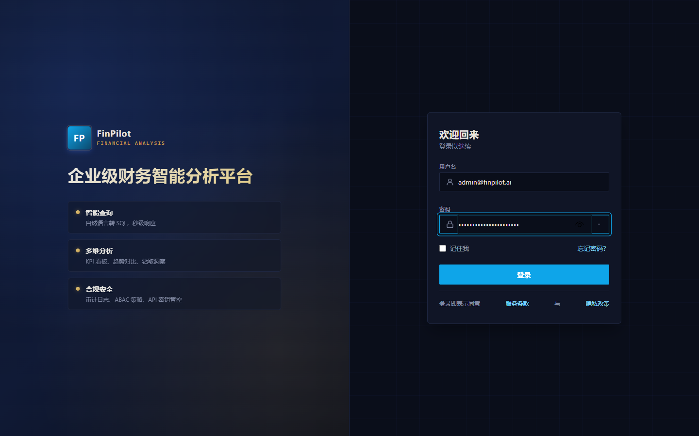
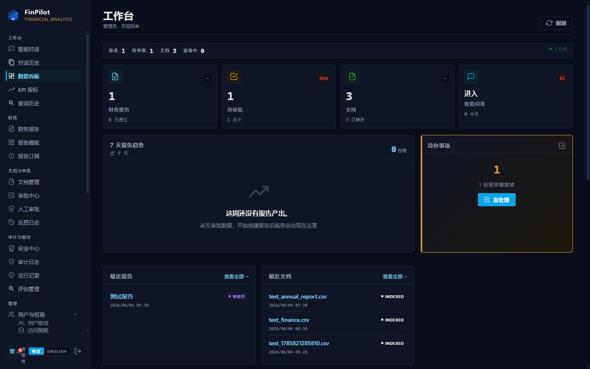
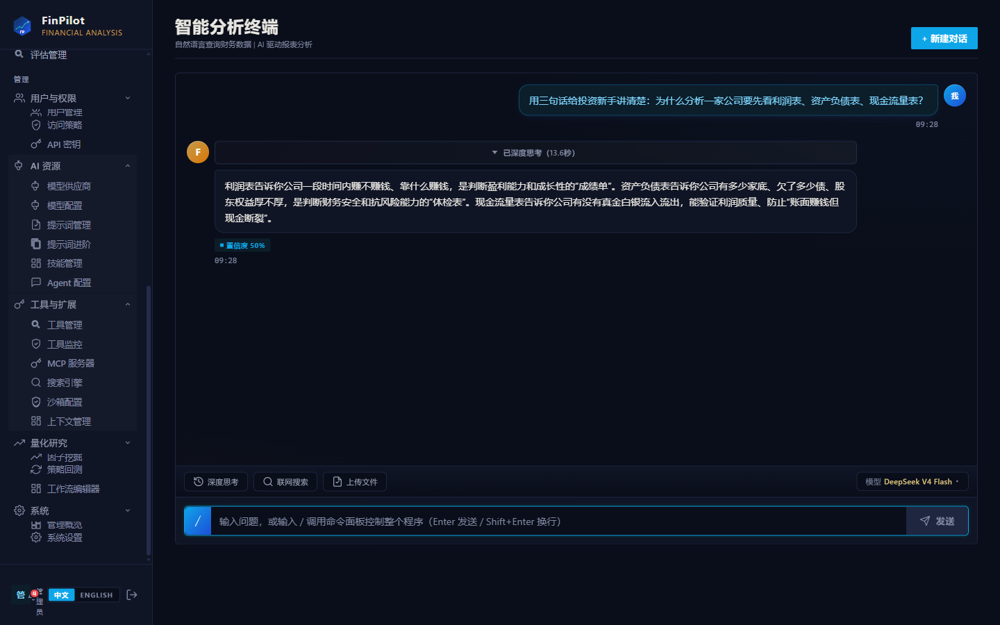
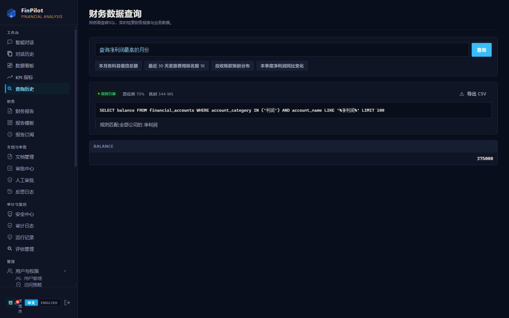
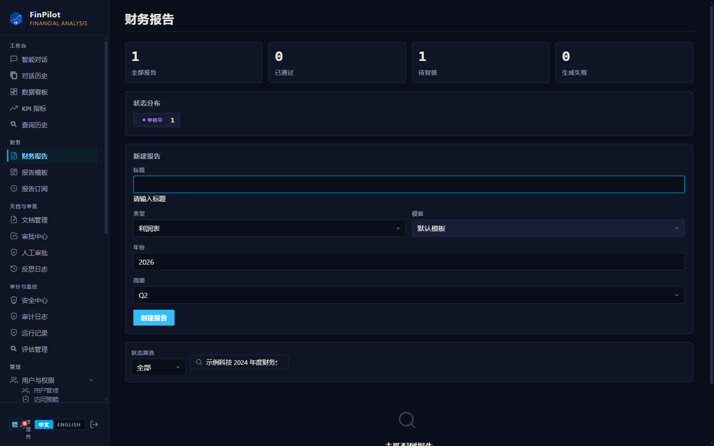
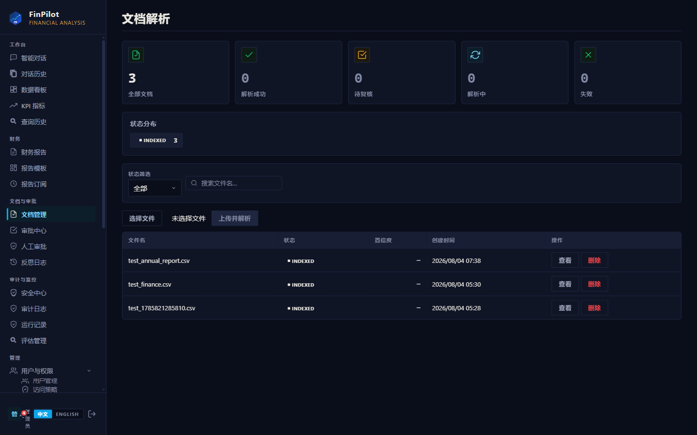
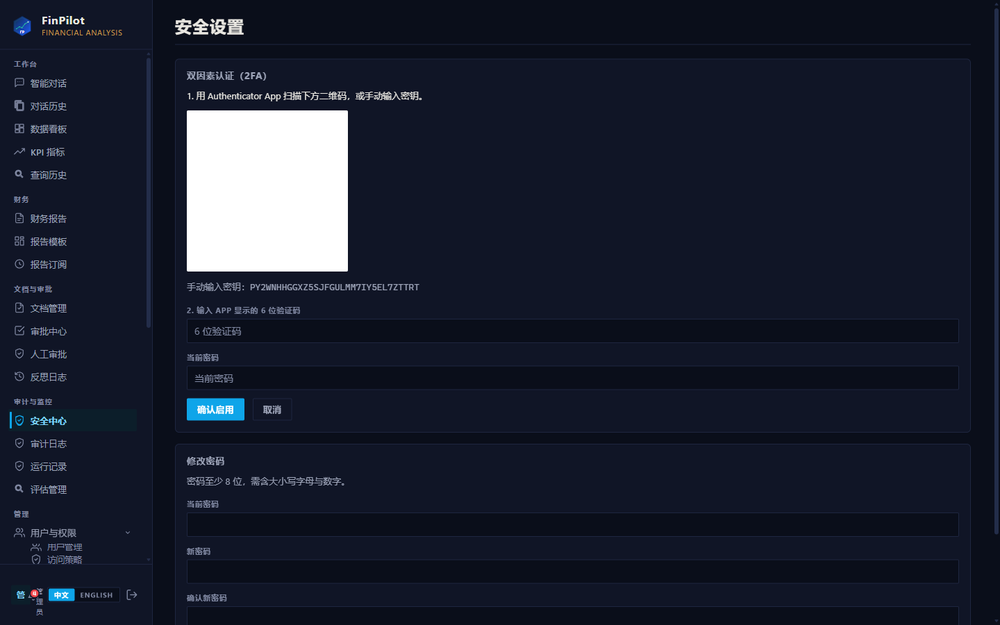
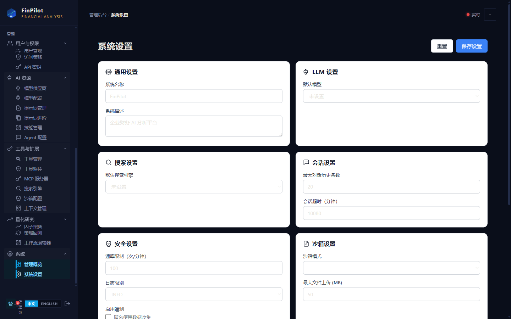
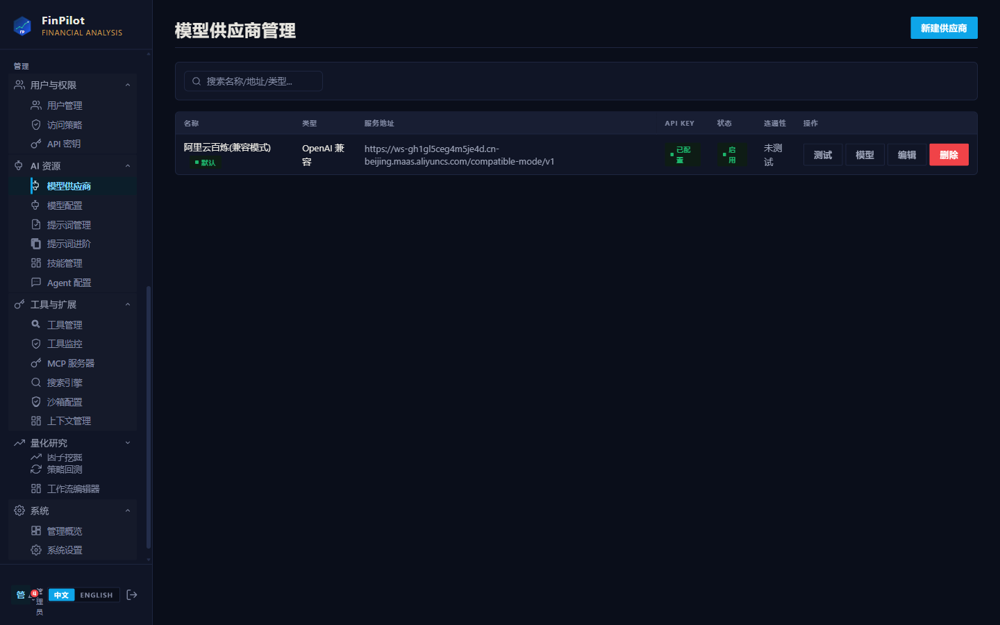
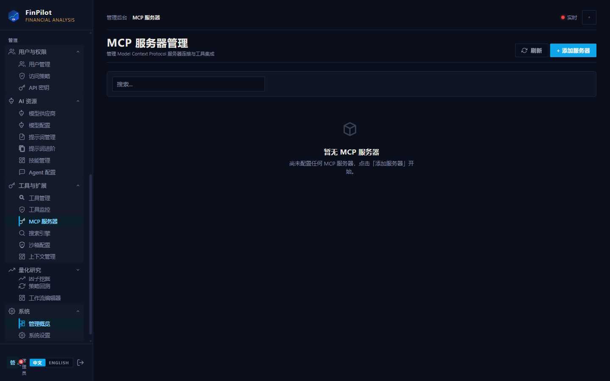

<div align="center">
  
</div>

<div align="center">

# FinPilot

**AI-Powered Financial Analysis Platform**

[](LICENSE)
[](https://www.python.org/)
[](https://fastapi.tiangolo.com/)
[](https://react.dev/)
[](https://www.typescriptlang.org/)
[](https://github.com/langchain-ai/langgraph)
[](CONTRIBUTING.md)

**Natural-language access to your financial data — with computed, traceable, and auditable results.**

[Quick Start](#quick-start) · [Core Capabilities](#core-capabilities) · [Product Showcase](#product-showcase) · [Key Differentiators](#key-differentiators) · [Technology Stack](#technology-stack) · [Roadmap](#roadmap) · [Contributing](#contributing)

</div>

---

<p align="center">
  <a href="README.md"><strong>English</strong></a> ·
  <a href="README.zh-CN.md">中文</a> ·
  <a href="README.ja.md">日本語</a>
</p>

---

## Overview

FinPilot is an open-source, enterprise-ready AI financial analysis platform. It connects large language models to your financial data through a structured agent pipeline, enabling finance teams to:

- **Query data in plain language** — natural-language questions are translated into SQL and executed against your database.
- **Automate report generation** — template-based report generation with subscription push and approval workflows.
- **Ask questions over documents** — RAG-based Q&A over Excel, PDF, CSV, and DOCX files.
- **Run financial modeling** — DCF, DDM, LBO, WACC, comparables, and Monte Carlo simulations on deterministic code.

Every output is **computed by code and narrated by the model**, with a complete run-log for traceability and audit.

---

## Core Capabilities

| Area | Capability |
| :--- | :--- |
| 🤖 Conversational Q&A | Upload Excel/PDF/CSV/DOCX in chat; SSE streaming with live reasoning steps |
| 📊 Financial Modeling | DCF · DDM · LBO · WACC · comparables · Monte Carlo — deterministic, pure-Python calculators |
| 📑 Report Center | Template-based reports, subscription push, approval workflow |
| 🔍 RAG Document Q&A | BM25 + vector + RRF fusion retrieval; multi-format document parsers |
| 🛡 Security & Compliance | ABAC access control, TOTP 2FA, PII masking, SQL-injection guard, audit log, role tiers |
| 📡 Run-Log | Live monitoring: logs, Q&A replay, module status, statistics |
| 🧰 Extensibility | Tools · Skills · MCP servers · code sandbox · prompt management |
| 💬 Chat-as-Control | Slash commands, role-filtered; full system administration from the chat interface |
| 📱 Mobile-First UI | Responsive mobile shell; desktop pages degrade gracefully |
| 🚨 Precise Error Handling | Layered error system (network / auth / client / server) with actionable diagnostics |

---

## Product Showcase

**Product demo (5:21, silent):** recorded on a live session — real login, real LLM calls, and real SQL executed against a real database.

<video controls src="docs/media/finpilot_demo.mp4" width="100%"></video>

<sub>[⬇ Download mp4](docs/media/finpilot_demo.mp4) if inline playback is not supported</sub>

| Login | Dashboard |
|:---:|:---:|
|  |  |

| Conversational Q&A | NL2SQL query result |
|:---:|:---:|
|  |  |

| AI-generated report | Document management |
|:---:|:---:|
|  |  |

| Security — 2FA setup | System settings |
|:---:|:---:|
|  |  |

| LLM providers (e.g. Aliyun Bailian) | MCP servers |
|:---:|:---:|
|  |  |

---

## Key Differentiators

1. **Computed, not generated.** Financial calculations (DCF, WACC, backtesting, ratios, …) run on deterministic code. The model explains results — it does not fabricate numbers.
2. **Fully traceable.** Every API call, Q&A turn, and module operation is recorded in the run-log, enabling step-by-step replay and audit.
3. **Chat as a control plane.** A role-filtered command palette (`/`) lets administrators operate the entire system from the conversation; regular users only see what their permissions allow.

Additional enterprise features: RAG document Q&A (BM25 + vector + RRF fusion), Excel/PDF/DOCX parsing, ABAC access control, TOTP 2FA, mobile-responsive UI, and a layered error system that identifies the exact layer of failure.

---

## Quick Start

```bash
git clone https://github.com/weed33834/FinPilot.git   # or any mirror below
cd FinPilot

# backend
python3 -m venv venv && source venv/bin/activate
pip install -e .
cp .env.example .env        # configure your LLM API key
uvicorn finpilot.api.router:app --host 0.0.0.0 --port 8001

# frontend
cd frontend && npm install && npm run dev
```

Open `http://localhost:5173`, sign in with the auto-created admin account (`FINPILOT_ADMIN_EMAIL` / `FINPILOT_ADMIN_PASSWORD` in `.env`), and start querying.

> LLM providers are configured in **Admin → LLM Providers** (stored in the database, with env-var fallback). Any OpenAI-compatible endpoint is supported — Aliyun Bailian, DeepSeek, Zhipu, and others.

Docker deployment: `docker compose up -d` (Redis + PostgreSQL + backend + frontend). See [docs/DEPLOYMENT.md](docs/DEPLOYMENT.md) for details.

---

## Technology Stack

Python 3.10–3.13 · FastAPI · LangGraph · SQLAlchemy · Pydantic · React 19 · Vite · TypeScript · Tailwind 4 · Zustand · Recharts · i18next · pdfplumber · openpyxl · BM25 · SQLite/PostgreSQL · Redis · Docker

---

## Roadmap

- ✅ **v1/v2** — conversational Q&A, RAG, run-log, reports & approvals, security baseline, slash commands, financial validation engine, multi-agent debate, backtesting & factor mining, MCP/skill/tool management, i18n (en/zh), mobile-first
- 🚧 **v2.1** — real-time market data, knowledge-graph fusion, enterprise SSO

Full history in [CHANGELOG.md](CHANGELOG.md).

---

## Contributing

Issues and pull requests are welcome — see [CONTRIBUTING.md](CONTRIBUTING.md). Report security issues via [SECURITY.md](SECURITY.md); do not disclose them in public issues.

---

## Mirrors

The same codebase is synchronized across three platforms — choose the one that works best for you.

| Platform | URL |
|----------|-----|
| **GitHub** | https://github.com/weed33834/FinPilot |
| **GitCode** | https://gitcode.com/badhope/FinPilot |
| **Gitee** | https://gitee.com/badhope/FinPilot |

---

## License

MIT — see [LICENSE](LICENSE).

> **Disclaimer:** for learning and research purposes only; not financial advice.
