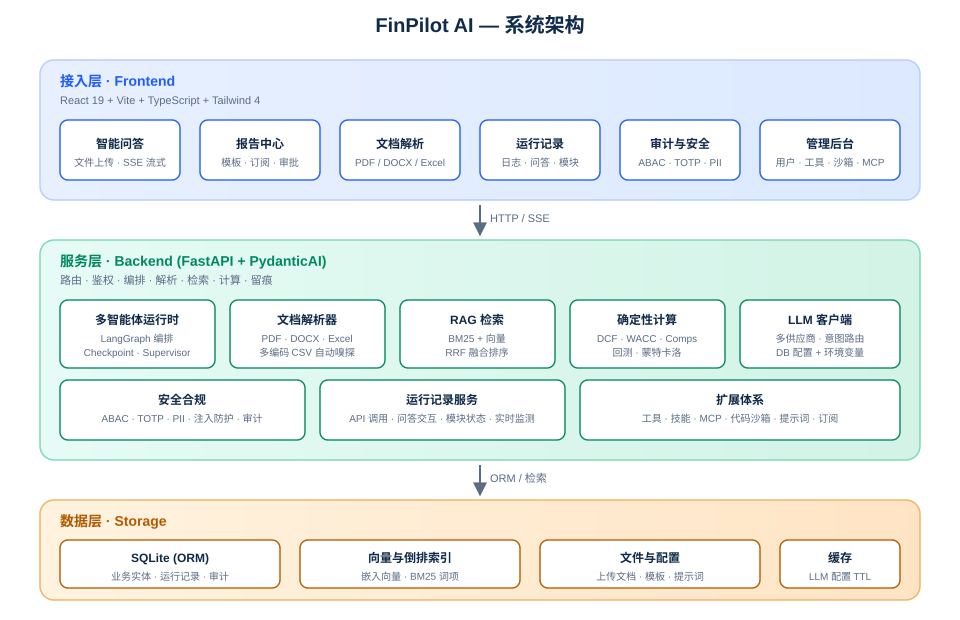
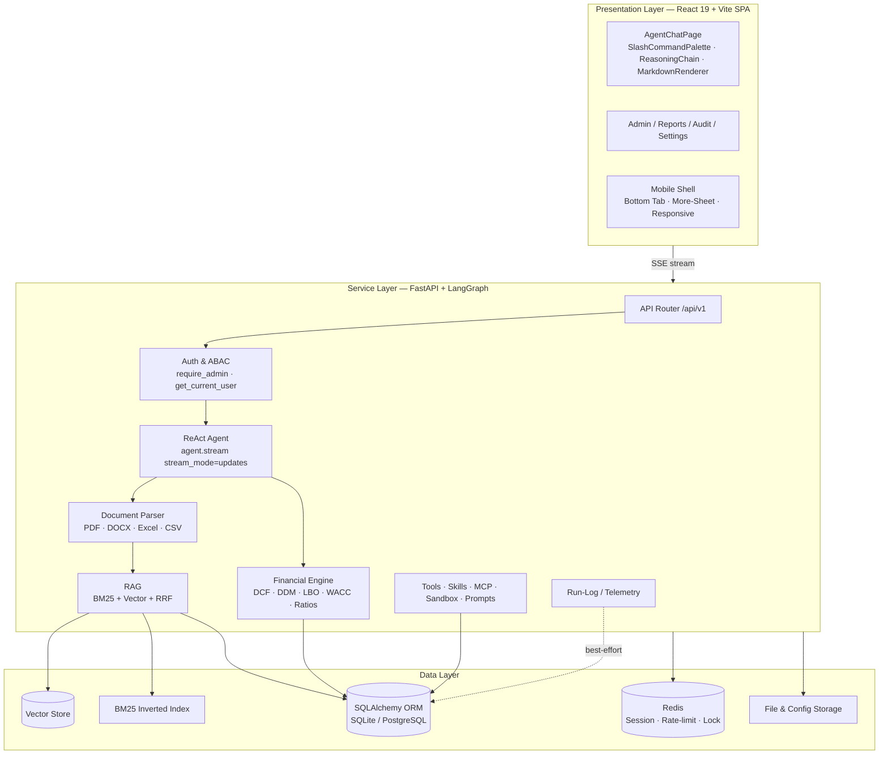
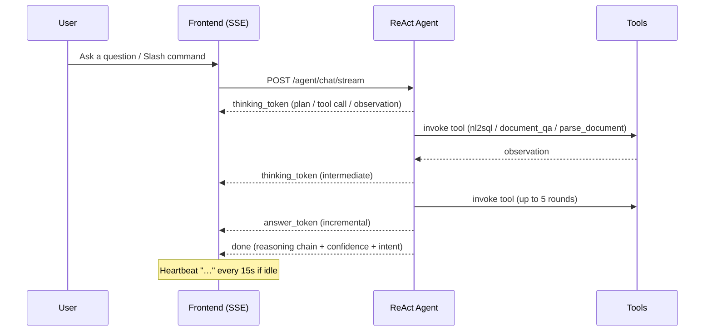

<div align="center">
  
</div>

<div align="center">

# FinPilot AI

**An open-source AI agent platform for enterprise finance · autonomous reasoning · full-stack observability**

[](#finpilot-ai)
[](LICENSE)
[](https://www.python.org/)
[](https://fastapi.tiangolo.com/)
[](https://react.dev/)
[](https://www.typescriptlang.org/)
[](https://vitejs.dev/)
[](https://tailwindcss.com/)
[](https://github.com/langchain-ai/langgraph)
[](CHANGELOG.md)
[](CONTRIBUTING.md)

**🤖 Agents · 📊 Financial Modeling · 📑 Report Center · 🛡 Security & Compliance · 🚨 Precise Errors · 💬 Chat-as-Control**

[Quick Start](#quick-start) ·
[Key Features](#key-features) ·
[Architecture](#architecture) ·
[ReAct Workflow](#react-workflow) ·
[Chat-as-Control](#chat-as-control) ·
[Error System](#error-system) ·
[Tech Stack](#tech-stack) ·
[Project Structure](#project-structure) ·
[Environment Variables](#environment-variables) ·
[Roadmap](#roadmap) ·
[Contributing](#contributing)

</div>

---

<p align="center">
  <a href="README.md"><strong>English</strong></a> ·
  <a href="README.zh-CN.md">中文</a> ·
  <a href="README.ja.md">日本語</a>
</p>

---

## Design Philosophy

FinPilot AI abstracts a real enterprise finance team's workflow into a four-stage closed loop: **Perceive → Reason → Act → Trace**.

- A **LangGraph**-orchestrated multi-role agent handles analysis, modeling, debate, and synthesis.
- Financial computation runs on **deterministic code paths** (DCF, WACC, comparable companies, backtesting); the LLM is responsible only for narrative and explanation.
- Every API call, every Q&A turn, and every module toggle is written to a **run-log**, making the whole system traceable and auditable.

> **Numbers are computed by code; narratives are generated by the model; every line of output is sourceable.**

---

## Key Features

| Module | Key Capabilities |
| :--- | :--- |
| 🤖 **Conversational Q&A** | Chat-upload Excel / PDF / CSV / DOCX, auto-parsed into context, **SSE streaming** pushes ReAct reasoning steps in real time |
| 📊 **Financial Modeling** | DCF, DDM, LBO, WACC, comparable companies, Monte Carlo — pure-Python calculation operators |
| 📑 **Report Center** | Report templates, subscription push, approval workflows, structured research output |
| 🔍 **Document Parsing** | Multi-format parsers (PDF / DOCX / Excel / CSV) + RAG retrieval (BM25 + vector + RRF fusion) |
| 🛡 **Security & Compliance** | ABAC access control, TOTP 2FA, PII masking, injection protection, audit logs, **role-based permissions** |
| 📡 **Run-Log** | Four-tab live monitoring: log list / Q&A interactions / module status / stats dashboard |
| 🧰 **Extensibility** | Unified access for tools, skills, MCP servers, code sandbox, and prompt management |
| 💬 **Chat-as-Control** | **Slash-command system** — invoke every feature from the chat UI, role-filtered |
| 📱 **Mobile-First** | Independent responsive mobile shell (bottom tab + more-sheet), desktop-only pages degrade gracefully |
| 🚨 **Precise Errors** | **FetchError + leveled highlighting** — network / auth / request / server four-color alert lamps |

---

## Architecture

<div align="center">
  
</div>

The system is divided into three layers:



- **Presentation Layer** — React 19 + Vite SPA; chat / reports / audit / admin panels with real-time SSE push.
  - `AgentChatPage` integrates the slash-command palette + leveled error bar + streaming reasoning steps.
  - `MarkdownRenderer` ships XSS sanitization and code-block syntax highlighting.
  - `SlashCommandPalette` offers fuzzy search + keyboard navigation + role filtering.
  - A dedicated **mobile shell** (`MobileShell`) serves touch-first navigation; 15+ desktop-only admin pages degrade to a friendly "open on desktop" prompt on small screens.
- **Service Layer** — FastAPI + LangGraph; routing / auth / agent orchestration / parsing / retrieval / computation / tracing.
  - The ReAct agent uses `agent.stream(stream_mode="updates")` to push each node's state in real time.
  - Compatible with multiple LLM output formats: standard ReAct three-part, `<tool_call>` XML, `<answer>` tags.
  - LLM configuration is read **first from the database** (maintained in the admin panel), with environment variables as fallback.
- **Data Layer** — SQLite (ORM), vector store, BM25 inverted index, file & config storage.
  - ReAct checkpoint supports two backends: `memory` (default) and `sqlite` (persistent).

For a deeper dive, see [docs/ARCHITECTURE.md](docs/ARCHITECTURE.md).

---

## ReAct Workflow



The ReAct loop runs up to **5 rounds** of tool calls; every node completion is pushed over SSE in real time:

- **start** — session created
- **thinking_token** — agent's reasoning / tool call / observation result
- **answer_token** — final-answer increment
- **done** — terminal event carrying the reasoning chain, confidence, and intent
- **error** — exception event (carrying detailed error info)

**Heartbeat protection**: if no event is pushed within 15 seconds, a `…` is sent to prevent the frontend from misjudging a timeout.

---

## Chat-as-Control

The chat UI is the **core** of FinPilot — administrators can invoke every feature via slash commands in the dialog, controlling the whole program, apps, and agents; ordinary users can only invoke commands within their permission scope.

### Slash Command Palette

Typing `/` in the dialog opens the command palette, with fuzzy search, keyboard up/down selection, and category grouping. All commands are role-filtered:

| Category | Example Commands | Role |
| :--- | :--- | :--- |
| **help** | `/help`, `/?` | all users |
| **data** | `/dashboard`, `/queries history`, `/conversations list`, `/documents list` | user |
| **report** | `/reports list`, `/reports generate 600519 贵州茅台`, `/reports status <task_id>` | user |
| **analysis** | `/factor categories`, `/backtest strategies` | user |
| **system** | `/admin status`, `/admin health`, `/models list`, `/models test <provider_id>` | admin |
| **admin** | `/users list`, `/audit logs`, `/approvals list`, `/templates list`, `/subscriptions list` | admin |

### Role Tiers

- **Admin**: can invoke all 19 commands across the five categories data / research / analysis / system / admin.
- **User**: can only invoke help + data + report + analysis — 9 commands — and cannot reach sensitive operations such as system status, user management, or audit logs.
- The backend `require_admin` dependency re-validates every admin command's endpoint; the frontend filter is UX-only.

---

## Error System

FinPilot's error system pursues **precise localization + high visibility** — no more zero-information fallbacks like "operation failed, please retry later."

### Error Levels & Colors

Each error shows a differently colored "alert lamp" with pulse animation + glow + gradient background, ensuring clarity in both dark and light themes:

| Level | Color | Trigger |
| :--- | :--- | :--- |
| `network` | gray | connection timeout, DNS failure, CORS rejected, backend not started |
| `auth` | yellow | 401 not logged in, 403 insufficient permission |
| `client` | orange | 400/404/422 request param error, route not found |
| `server` | red | 500/502/503 internal server error |
| `unknown` | red | catch-all unclassified error |

### Error Message Format

The error bar shows the exact endpoint, HTTP method, status code, and backend `detail`, e.g.:

```
[POST /agent/chat/stream] 500 Internal Server Error — KeyError: 'react_steps'
[network] Request timed out (30s) — backend did not respond in time; LLM may be slow or backend blocked
[GET /model-configs] 422 Validation failed — body.question: field required
```

### Implementation Notes

- `FetchError` class carries `status` / `url` / `method` / `bodyText` / `code`, so SSE endpoints called via `fetch` (not axios) can also reuse the unified error system.
- `getErrorLevel(err)` infers the level automatically from `FetchError` / `AxiosError` / `DOMException` / `TypeError`.
- `getErrorMessage(err)` converts the raw error into a precise string with source tag + status code + backend reason.

---

## Security & Compliance

| Capability | Description |
| :--- | :--- |
| **ABAC** | Attribute-based access control; policies evaluated per request, not just per role |
| **TOTP 2FA** | RFC 6238 one-time passwords with QR enrollment and backup codes |
| **PII Masking** | Automatic detection and masking of sensitive fields in logs and responses |
| **Injection Protection** | Prompt-injection heuristics on document/tool inputs |
| **Audit Log** | Immutable record of every privileged action |
| **Role Tiers** | `admin` vs `user`; backend re-validates privileged endpoints |

---

## Tech Stack

| Category | Selection |
| :--- | :--- |
| Backend | Python 3.10–3.13, FastAPI, LangGraph, SQLAlchemy, Pydantic |
| Frontend | React 19, Vite, TypeScript, Tailwind 4, Zustand, Recharts, i18next |
| Docs & Retrieval | pdfplumber, python-docx, openpyxl, pandas, BM25, vector search, RRF fusion |
| Data | SQLite (default), PostgreSQL (production option) |
| Deployment | Docker, Uvicorn, Nginx (optional reverse proxy) |
| Security | ABAC, TOTP, PII masking, injection protection, audit log |

---

## Quick Start

### 1. Clone the repository

```bash
git clone https://gitcode.com/badhope/FinPilot.git
cd FinPilot
```

### 2. Prepare the Python environment

```bash
python3 -m venv venv
source venv/bin/activate   # Windows: venv\Scripts\activate
pip install -e .
```

> Requires Python 3.10–3.13. [pyenv](https://github.com/pyenv/pyenv) is recommended for multi-version management.

### 3. Configure environment variables

Copy the example file and edit as needed (all variables are optional):

```bash
cp .env.example .env
```

A minimal config only needs an LLM provider. FinPilot's LLM configuration is read **first from the database** (maintained in Admin → LLM Providers), with environment variables as fallback.

**Option A — environment variables (quick try)**

```bash
export OPENAI_API_KEY="sk-..."
# optional:
export OPENAI_BASE_URL="https://api.openai.com/v1"
export OPENAI_MODEL="gpt-4o-mini"
```

**Option B — OpenAI-compatible provider (e.g. MoonWeaver)**

```bash
# Create in Admin → LLM Providers:
#   name=MoonWeaver, provider_type=openai, base_url=https://api.587.lol/v1
#   api_key=any, is_default=true
#   models: moonweaver-4.8 (mount to both high/low tier)
```

Anthropic is also supported:

```bash
export ANTHROPIC_API_KEY="sk-ant-..."
export ANTHROPIC_MODEL="claude-3-5-sonnet-20241022"
```

### 4. Start the backend

```bash
uvicorn finpilot_equity.web_app.main:app --host 0.0.0.0 --port 8001
```

On first start, if `FINPILOT_ADMIN_EMAIL` + `FINPILOT_ADMIN_PASSWORD` are set, a default admin is auto-created; otherwise auto-creation is skipped (safer — register manually or via a migration script).

| Field | Env Var | Default |
| :--- | :--- | :--- |
| Email | `FINPILOT_ADMIN_EMAIL` | `admin@finpilot.ai` |
| Password | `FINPILOT_ADMIN_PASSWORD` | unset (not created) |

```bash
export FINPILOT_ADMIN_PASSWORD="your-strong-password"
```

### 5. Start the frontend

```bash
cd frontend
npm install
npm run dev
```

Open `http://localhost:5173` and log in with the default admin account.

### 6. Containerized deployment (recommended for production)

```bash
cp .env.example .env          # edit secrets (SECRET_KEY, FINPILOT_ADMIN_PASSWORD, ...)
docker compose up -d          # Redis + PostgreSQL + backend + frontend
docker compose logs -f backend
```

Service ports:

- Frontend: `http://localhost:8080`
- Backend: `http://localhost:8010` (API + `/health` + `/metrics`)
- Redis: `6379` · PostgreSQL: `5432`

The backend `/health/ready` endpoint is used by Compose / K8s `depends_on` for readiness. See [docs/DEPLOYMENT.md](docs/DEPLOYMENT.md) for details.

---

## Project Structure

```
FinPilot AI
├── finpilot/                 # backend business package
│   ├── agent/                # multi-agent runtime (LangGraph orchestration)
│   │   ├── graph.py          # ReAct graph build + run_agent entry
│   │   ├── react_nodes.py    # agent/tools/finalize nodes + multi-format parser
│   │   ├── checkpoint.py     # checkpoint backends (memory / sqlite)
│   │   └── tools/            # built-in tools (nl2sql / document_qa / parse_document)
│   ├── api/                  # FastAPI routes
│   │   ├── router.py         # aggregated router + default-admin init
│   │   ├── agent.py          # SSE streaming chat (agent.stream)
│   │   ├── compat.py         # frontend contract compatibility layer
│   │   ├── llm_providers.py  # LLM provider CRUD
│   │   └── deps.py           # auth deps (require_admin / get_current_user)
│   ├── database/             # ORM models & CRUD
│   ├── llm/                  # LLM client / config / model routing
│   ├── parser/               # multi-format document parsers (PDF / DOCX / Excel / CSV)
│   ├── rag/                  # retrieval augmentation (BM25 + vector + RRF fusion)
│   ├── security/             # ABAC / TOTP / PII / audit / injection protection
│   ├── services/             # business services (valuation / backtest / sandbox / run-log / ...)
│   ├── text2sql/             # natural language to SQL
│   └── utils/                # common utilities
├── finpilot_equity/          # web application entry package
│   └── web_app/              # FastAPI app assembly (route mount / CORS / DB init)
├── frontend/                 # React + Vite SPA
│   └── src/
│       ├── pages/            # AgentChatPage / Admin / Reports / Mobile / ...
│       ├── components/       # SlashCommandPalette / MarkdownRenderer / ReasoningChain / ...
│       ├── mobile/           # MobileShell / MobilePageHeader / *Mobile pages
│       ├── utils/            # errors.ts (FetchError) / slashCommands.ts / ...
│       ├── api/              # client.ts / adminClient.ts (axios instances)
│       ├── stores/           # authStore (zustand, role field)
│       ├── i18n/             # locales: en / zh-CN
│       └── index.css         # global styles + error-bar lamp highlight
├── docs/                     # architecture.svg, workflow.svg, API/ARCHITECTURE/DEPLOYMENT docs
├── .github/                  # Issue / PR templates + CI workflow
├── .env.example              # environment variable example
├── CHANGELOG.md              # change log
├── CONTRIBUTING.md           # contribution guide
├── SECURITY.md               # security policy
├── CODE_OF_CONDUCT.md        # code of conduct
├── Dockerfile                # container build definition
├── docker-compose.yml        # one-command orchestration (Redis + PG + backend + frontend)
├── setup.py                  # Python package definition
├── requirements.txt          # Python dependencies (covers finpilot/ and finpilot_equity/)
└── README.md
```

---

## Environment Variables

The full list is in [`.env.example`](.env.example). Summary:

| Variable | Purpose | Default |
| :--- | :--- | :--- |
| `FINPILOT_ADMIN_EMAIL` | default admin email | `admin@finpilot.ai` |
| `FINPILOT_ADMIN_PASSWORD` | default admin password | unset (not created) |
| `FINPILOT_ADMIN_EMAILS` | admin email whitelist (comma-separated) | `admin@finpilot.ai` |
| `OPENAI_API_KEY` / `OPENAI_BASE_URL` / `OPENAI_MODEL` | OpenAI provider | — |
| `ANTHROPIC_API_KEY` / `ANTHROPIC_BASE_URL` / `ANTHROPIC_MODEL` | Anthropic provider | — |
| `FINPILOT_LLM_DEMO_FALLBACK` | enable demo fallback when LLM unavailable | disabled |
| `FINPILOT_CHECKPOINT_BACKEND` | ReAct checkpoint backend (`memory` / `sqlite`) | `memory` |
| `FINPILOT_DATABASE_URL` | DB connection (overrides SQLite default) | SQLite |
| `REDIS_URL` | Redis (session / rate-limit / lock) | — |
| `SECRET_KEY` | session encryption key (≥32 bytes, required in prod) | — |
| `ENVIRONMENT` | `production` / `development` | `production` |
| `GITHUB_CLIENT_ID` / `GITHUB_CLIENT_SECRET` / `GITHUB_REDIRECT_URI` | GitHub OAuth login | placeholders |

---

## Run-Log Module

The Settings panel ships a **Run-Log** module for real-time monitoring of the whole pipeline:

| Tab | Purpose |
| :--- | :--- |
| **Stats Dashboard** | total logs, today's additions, success rate, module-enable aggregation |
| **Log List** | each API call's category / level / source / duration / status / payload detail |
| **Q&A Interactions** | session-dimension aggregation, replay user questions and agent answers |
| **Module Status** | enable stats for LLM / tools / skills / sandbox / MCP / RAG / Text2SQL |

Logs are written best-effort (a logging failure never blocks the main flow) and can be exported to CSV for offline analysis with one click.

---

## Roadmap

- ✅ **v1.0.0** — conversational Q&A, document parsing, run-log, reports & approvals, security baseline, slash-command system, leveled error system, SSE streaming ReAct push
- ✅ **v2.0.0** — financial validation engine, multi-agent debate, explainability, risk analysis, ratio analysis, three-statement modeling (DCF/DDM/LBO), data-connection management, backtest enhancement, factor mining, MCP server management, skill/tool/prompt management, sandbox config, runtime logs, dashboards (admin + user), **full i18n (en/zh-CN)**, **mobile-first responsive adaptation**
- 🚧 **v2.1.0** — real-time market data, knowledge-graph fusion, enterprise SSO

Full change history in [CHANGELOG.md](CHANGELOG.md).

---

## Contributing

Issues and Pull Requests are welcome. Please read [CONTRIBUTING.md](CONTRIBUTING.md) for development conventions and commit rules; the code of conduct is in [CODE_OF_CONDUCT.md](CODE_OF_CONDUCT.md).

Report security vulnerabilities per [SECURITY.md](SECURITY.md); **do not disclose security issues in public Issues**.

### Contributors

<a href="https://github.com/weed33834/FinPilot/graphs/contributors">
  
</a>

---

## Mirrors

FinPilot is published simultaneously on three platforms. All of them are kept at the same commit — pick whichever is fastest for you.

| Platform | URL | Notes |
|----------|-----|-------|
| **GitHub** | https://github.com/weed33834/FinPilot | Canonical source, Issues & PRs |
| **GitCode** | https://gitcode.com/badhope/FinPilot | Recommended in mainland China |
| **Gitee** | https://gitee.com/badhope/FinPilot | Recommended in mainland China |

```bash
# Clone from the fastest mirror
git clone https://gitcode.com/badhope/FinPilot.git
```

> Maintainers push to all three at once via a single `origin` with multiple push URLs.
> Please open Issues / Pull Requests on **GitHub** so discussions stay in one place.

---

## License

This project is open-sourced under the [MIT License](LICENSE). Copyright belongs to the FinPilot AI project team; it has no affiliation with any external project.

---

> **Disclaimer**: The code and documentation of this project are for learning and research only, and should not be considered financial advice or trading recommendations. Consult a qualified professional before any actual trading or investment.
