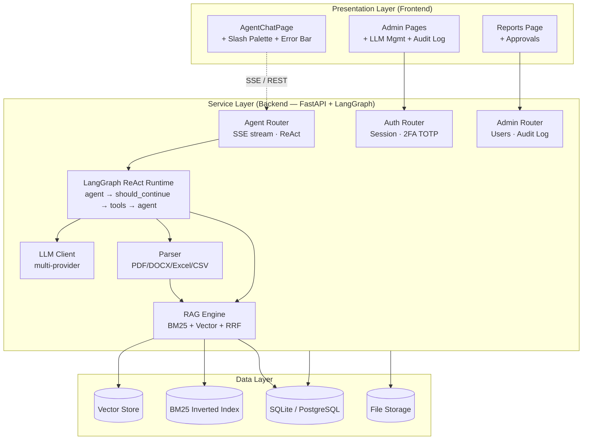
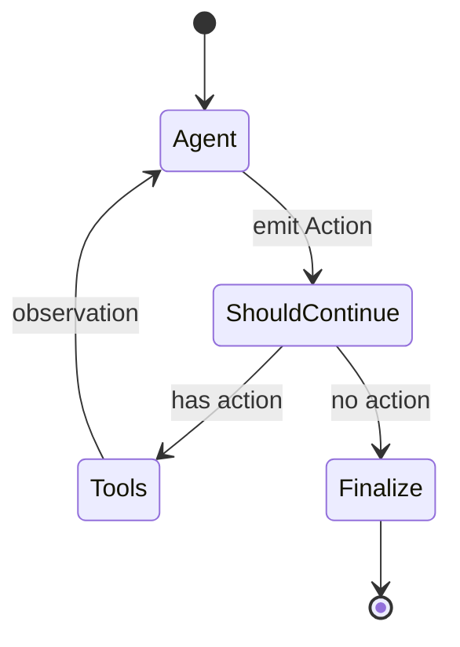

# FinPilot AI — Architecture

This document describes FinPilot AI's overall architecture, core subsystems, data flow, and key design decisions.

> A high-level visual is available at [`architecture.svg`](architecture.svg). The diagrams below are kept as text (Mermaid) so they are version-controlled and diffable.

## Three-Layer Architecture



- **Presentation** — React 19 + Vite SPA. `AgentChatPage` integrates the slash palette, error bar, and streaming reasoning. Admin pages cover LLM provider management and audit logs; the Reports page covers generation and approvals.
- **Service** — FastAPI + LangGraph. Routing, auth, agent orchestration, parsing, retrieval, and tracing.
- **Data** — SQLite (default) / PostgreSQL (production), vector store, BM25 inverted index, and file storage.

## Core Subsystems

### 1. Agent Runtime (LangGraph ReAct)

**Location**: `finpilot/agent/`

The ReAct (Reasoning + Acting) loop is FinPilot's core inference engine:



**Key files**:

| File | Responsibility |
| :--- | :--- |
| `graph.py` | graph build + `run_agent` entry + `make_thread_id` |
| `react_nodes.py` | agent/tools/finalize/should_continue nodes + ReAct output parser |
| `checkpoint.py` | checkpoint backends (`memory` / `sqlite`) |
| `tools/` | built-in tools (`nl2sql` / `document_qa` / `parse_document`) |
| `state.py` | `AgentState` TypedDict definition |

The **ReAct output parser** (`parse_react_output`) supports three LLM output formats:

1. **Standard ReAct three-part**:
   ```
   Thought: I need to query the data
   Action: nl2sql
   Action Input: {"question": "this month's revenue"}
   ```
2. **`<tool_call>` XML style** (Qwen / Mistral families):
   ```
   <tool_call>
   <function=nl2sql>
   <parameter=question>query this month's revenue</parameter>
   </function>
   </tool_call>
   ```
3. **`<answer>` tag** (some models answer directly):
   ```
   <answer>this month's revenue is 1M</answer>
   ```

**Degradation path**: when the LLM is unavailable (no config / call fails / demo mode), `_degrade_to_rule` invokes the corresponding tool directly by intent, without blocking the main flow.

**Max rounds**: 5 tool-call rounds (`MAX_REACT_STEPS = 5`); beyond that, force `finalize`.

### 2. SSE Streaming Chat

**Location**: `finpilot/api/agent.py`

`/api/v1/agent/chat/stream` uses `agent.stream(stream_mode="updates")` instead of `agent.invoke()` for real-time push:

```python
for chunk in agent.stream(initial_state, config=config, stream_mode="updates"):
    for node_name, state_update in chunk.items():
        if node_name == "agent":
            yield _sse("thinking_token", {"content": f"💭 {thought}\n"})
            yield _sse("thinking_token", {"content": f"🔧 Calling tool: {action}\n"})
        elif node_name == "tools":
            yield _sse("thinking_token", {"content": f"📋 Result: {observation[:200]}\n"})
        elif node_name == "finalize":
            final_state = {**final_state, **state_update}
```

**Heartbeat protection**: if no event for 15s, push `…\n` to prevent the frontend from misjudging a timeout.

**Event types**:
- `start` — carries `conversation_id`
- `thinking_token` — ReAct reasoning-step increment
- `answer_token` — final-answer chunk (~12 chars/frame)
- `done` — completion, carries `react_steps` and `confidence`
- `error` — server-side error

### 3. Slash Command System

**Location**: `frontend/src/utils/slashCommands.ts` + `frontend/src/components/SlashCommandPalette.tsx`

The chat UI is the control center; 19 commands are role-filtered:

| Category | Count | Role |
| :--- | :--- | :--- |
| help | 1 | all users |
| data | 4 | user |
| report | 3 | user |
| analysis | 2 | user |
| system | 4 | admin |
| admin | 5 | admin |

**Permission model**:
- Frontend `getCommandsForRole(role)` filters visible commands by role.
- Backend `require_admin` dependency re-validates every admin command's endpoint.
- Frontend filtering is UX-only and does **not** constitute a security boundary.

**Command parsing**: `parseSlashCommand(raw, role)` supports multi-word command names (e.g. `/reports generate`); the last argument consumes the remaining value to support space-containing values (e.g. `/reports generate 600519 贵州茅台`).

### 4. Error System

**Location**: `frontend/src/utils/errors.ts`

**`FetchError` class**: carries `status` / `url` / `method` / `bodyText` / `code`, so SSE endpoints called via `fetch` (not axios) can also reuse the unified error system.

**Error levels** (`getErrorLevel`):
- `network` — no HTTP response (timeout, DNS, CORS, connection refused)
- `auth` — 401/403
- `client` — 4xx (except 401/403)
- `server` — 5xx
- `unknown` — catch-all

**Error format** (`getErrorMessage`):
```
[METHOD /url] STATUS label — backend detail
[network] Request timed out (30s) — backend did not respond in time
```

**UI rendering** (`index.css` `.chat-error-bar`):
- 5 level colors (server=red, auth=yellow, client=orange, network=gray, unknown=red)
- pulse animation + glow + gradient background + left color bar
- entrance animation (slide-in + 2 pulses then stop)

### 5. Multi-Provider LLM Configuration

**Location**: `finpilot/llm/`

**Configuration priority**:
1. Database (`llm_providers` + `llm_models` tables, maintained in the admin panel)
2. Environment variables (`OPENAI_*` / `ANTHROPIC_*`)
3. In-code defaults

**Cache**: 60s TTL module-level cache (`_cache` dict); `invalidate_cache()` actively clears it on provider changes.

**`ModelRouter`**: routes model tier (low/medium/high) by question complexity — cheap models for simple questions, high-performance models for complex ones.

**Tested providers**:
- OpenAI (`gpt-4o-mini`)
- Anthropic (`claude-3-5-sonnet`)
- MoonWeaver (`api.587.lol`, OpenAI-compatible, `moonweaver-4.8`)
- Ollama (local deployment)

### 6. Document Parsing & RAG

**Location**: `finpilot/parser/` + `finpilot/rag/`

**Multi-format parsers**:
- PDF: pdfplumber + pypdfium2
- DOCX: python-docx
- Excel: openpyxl + pandas
- CSV: pandas

**RAG retrieval**:
- BM25 inverted index (`rank-bm25`)
- Vector search
- RRF (Reciprocal Rank Fusion) to fuse the two result streams

### 7. Security & Compliance

**Location**: `finpilot/security/`

- ABAC (Attribute-Based Access Control)
- TOTP 2FA (`pyotp`)
- PII masking
- SQL injection protection
- Audit log (every sensitive action is traced)

## Data Flow

### User question → answer (SSE streaming)

```mermaid
flowchart TD
  A[User types question in AgentChatPage] --> B[fetch POST /api/v1/agent/chat/stream]
  B --> C[Backend event_generator]
  C --> D[yield start (conversation_id)]
  D --> E[classify_intent + extract_parameters]
  E --> F[build_agent(tenant_id, user_id, db)]
  F --> G{for chunk in agent.stream<br/>stream_mode=updates}
  G --> H[agent node → yield thinking_token (💭 thought + 🔧 action)]
  G --> I[tools node → yield thinking_token (📋 observation)]
  G --> J[finalize node → collect final_state]
  H --> K[for chunk in answer: yield answer_token (~12 chars/frame)]
  I --> K
  J --> K
  K --> L[crud.add_message(assistant, answer)]
  L --> M[yield done (react_steps, confidence)]
  M --> N[Frontend accumulates thinking + answer, shows streaming cursor]
  N --> O[done event → close cursor, show reasoning chain + confidence]
```

### Slash command execution

```
User inputs /reports generate 600519 贵州茅台
  ↓
handleSubmit detects leading / → calls executeSlashCommand
  ↓
parseSlashCommand(raw, role)
  ├─ match command name "reports generate"
  ├─ extract args ["600519", "贵州茅台"]
  └─ return {command, args}
  ↓
command.handler(args) → api.post('/reports/generate', {...})
  ↓
Backend creates async task, returns task_id
  ↓
Frontend renders result as a Markdown table inserted into the chat stream
```

## Design Decisions

### Why LangGraph instead of calling the LLM directly?

- **Observability**: each node's (agent/tools/finalize) state can be streamed, so users see ReAct reasoning steps.
- **Resumable**: `MemorySaver` / SQLite checkpoints support session persistence and resumption after interruption.
- **Orchestratable**: the graph clearly expresses the "agent → tools → agent" loop, easing multi-agent extension.
- **Degradation path**: when the LLM is unavailable, tools are called directly by intent without blocking the main flow.

### Why SSE instead of WebSocket?

- **One-way stream**: only server push is needed, no client bidirectional messages.
- **HTTP-compatible**: standard HTTP, no protocol upgrade, Nginx/CDN friendly.
- **Auto-reconnect**: browsers natively support `EventSource` reconnection.
- **Simpler deployment**: no WebSocket load-balancer config required.

### Why a hand-rolled MarkdownRenderer instead of react-markdown?

- **No new dependency**: the project does not install `react-markdown` / `remark` / `rehype`, avoiding React 19 peer-dependency risk.
- **XSS protection**: HTML escaping + DOMPurify secondary sanitization.
- **Code highlighting**: built-in lightweight syntax highlighting (python / sql / json / js / bash).
- **Table support**: GFM pipe tables with alignment.
- **Code-block copy**: event delegation, no per-block binding.

### Why FetchError instead of axios for the error system?

- **SSE endpoints use `fetch`**: streaming responses need `ReadableStream`, which axios does not support.
- **Unified error handling**: `FetchError` mimics `AxiosError`'s fields (`status`/`url`/`method`), so `getErrorMessage` handles both error types uniformly.
- **Leveled highlighting**: `getErrorLevel` infers the level automatically from `FetchError` / `AxiosError` / `DOMException` / `TypeError`.

## Extension Points

### Add a new tool

1. Create a tool function in `finpilot/agent/tools/`, register it with `@tool_registry.register`.
2. Tool signature: `def my_tool(ctx: ToolContext, **params) -> dict`.
3. The tool automatically appears in the ReAct system prompt's available-tools list.

### Add a new slash command

1. Add a command definition to the `COMMANDS` array in `frontend/src/utils/slashCommands.ts`.
2. Specify `role: 'admin' | 'user'`, `category`, `name`, `usage`, `description`, `handler`.
3. The handler calls `api` or `adminApi`, uses `unwrap()` to extract `data`, and `renderTable()` to render a Markdown table.
4. The command automatically appears in the `/help` list and the `SlashCommandPalette` panel.

### Add a new LLM provider

1. Create it in Admin → LLM Providers (set `provider_type` to `openai`/`anthropic`/`ollama`).
2. Or create via API `POST /api/v1/llm-providers`.
3. Custom protocols require adding a branch in `finpilot/llm/client.py`'s `LLMClient.chat()`.
